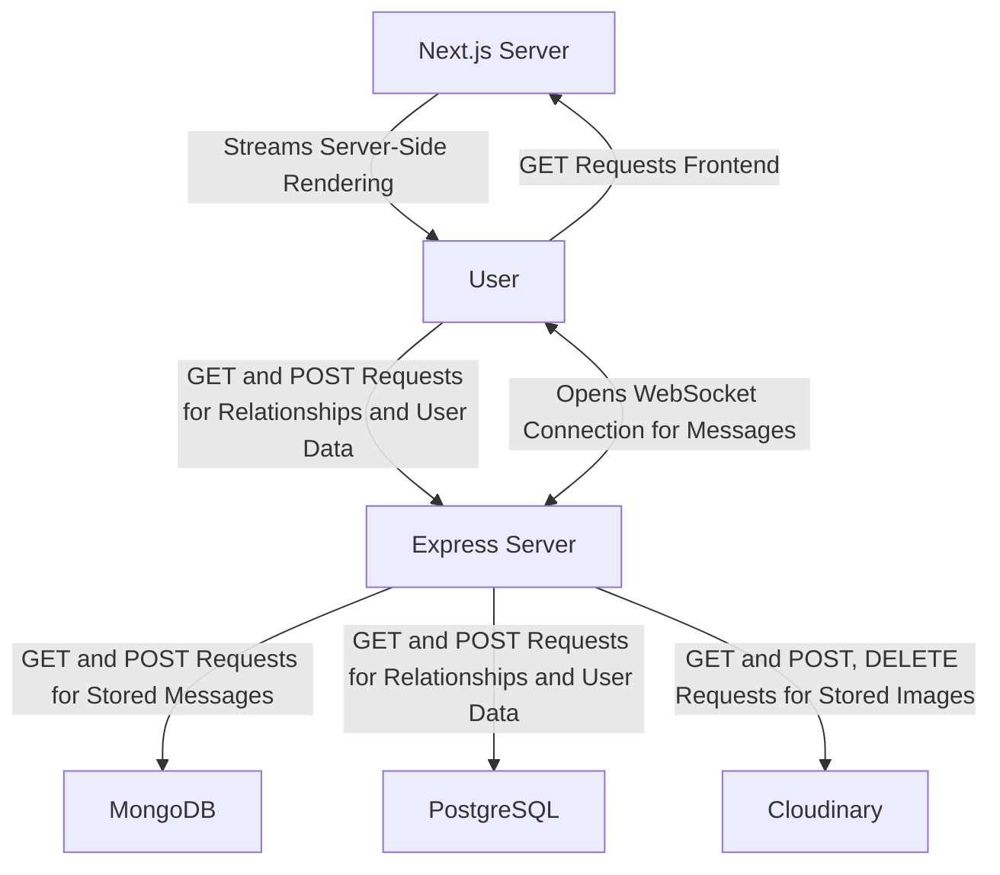
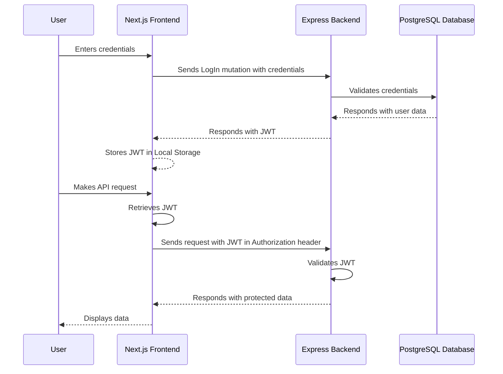
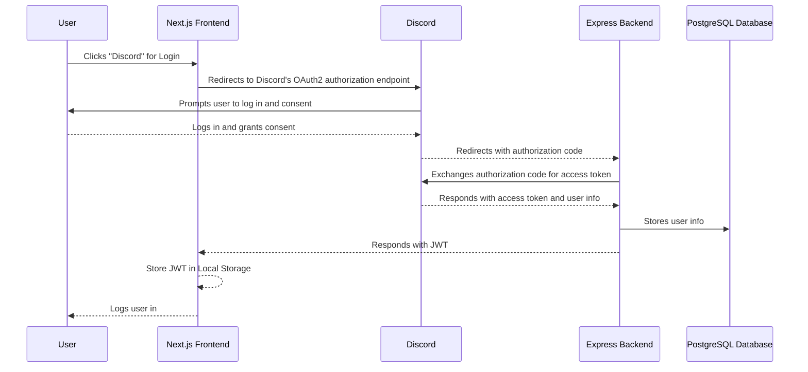

# Co-Engine

## Description

A platform for driving connections with others.

Features:

- Real-time messaging and group chat
- Relationship management for friends and blocked users
- User authentication and authorization with JWTs and Discord Oauth2
- User settings with profile picture, bio, and display name

Technologies:

- Next.js
- Express
- Passport
- GraphQL with Apollo
- PostgreSQL with Sequelize
- MongoDB with Mongoose
- Playwright

## Prerequisites

- Node.js (>=20.9.0)
- Docker (>=20.10.0)
- Docker Compose (>=2.29.1)
- Git

## Installation

1. Clone the repository

   ```bash
   git clone https://github.com/co-engine/co-engine.git
   ```

2. Install dependencies

   ```bash
   cd co-engine && (cd server && npm install) && (cd client && npm install)
   ```

3. Set up environment variables

   ```bash
   # docker/.env

   # Key for JWT signing
   JWT_SECRET=example-secret

   # Discord Oauth2
   DISCORD_CLIENT_ID=example-client-id
   DISCORD_CLIENT_SECRET=example-client-secret

   # Cloudinary
   CLOUDINARY_CLOUD_NAME=example-cloud-name
   CLOUDINARY_API_KEY=example-api-key
   CLOUDINARY_API_SECRET=example-api-secret
   ```

## Usage

1. Start the development servers

   ```bash
   docker compose -f docker/docker-compose.dev.yml up -d
   ```

2. Stop the development servers

   ```bash
   docker compose -f docker/docker-compose.dev.yml down -v
   ```

3. Start the production servers

   ```bash
   docker compose -f docker/docker-compose.local-prod.yml up -d
   ```

4. Stop the production servers

   ```bash
   docker compose -f docker/docker-compose.local-prod.yml down -v
   ```

5. Start the e2e tests

   ```bash
   docker compose -f docker/docker-compose.e2e.yml up -d
   ```

6. Stop the e2e tests

   ```bash
   docker compose -f docker/docker-compose.e2e.yml down -v
   ```

## Architecture

**Entity Relationship Diagram**


**Data Flow Diagram for Messages and Relationship Management**



**Sequence Diagram for JWT Authentication**



**Sequence Diagram for Discord Oauth2**



## Next Steps

- Add message reactions
- Add collaborations (groups)
- Add collaboration channels for text, whiteboarding, and video calls
- Add roles and permissions
